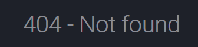
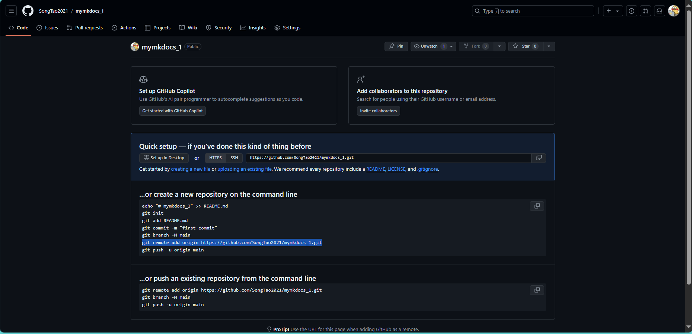

# 你好





 git remote add origin https://github.com/SongTao2021/mymkdocs_1.git

```
echo "# mymkdocs_3" >> README.md
git init
git add README.md
git commit -m "first commit"
git branch -M main
git remote add origin https://github.com/SongTao2021/mymkdocs_3.git
git push -u origin main
```

